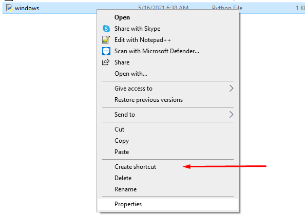

# Discord Color Changer
Change the accent color of discord, without modifying the client

Thanks to https://medium.com/@dany74q/injecting-js-into-electron-apps-and-adding-rtl-support-for-microsoft-teams-d315dfb212a6 for pointing me in the right direction

## TOS warning
Discord TOS states you cannot modify the client, as this does not modify any of the discord client files but rather injects code after launch, it should(?) be compliant (depending on how you interpret "modify"). Use at your own risk.

# Install

### Prerequisites
- node
- npm
- python3 (windows only)

As long as youre using reasonably up to date versions of the above you should be fine

### All systems
1. Clone this repository
2. `npm install`

Note: If you let discord startup with your system, you will need to "start" the apps manually after a boot for the inject to occur

### Linux
This'll show you how to modify your .desktop file for discord to make the inject launch alongside discord and open up the remote debugging port for chromium

Note: If your desktop environment does not make use of .desktop files, the install process will be different

1. Locate the .desktop file for discord

ex: 
```
$ locate *.desktop | grep discord
> /usr/share/applications/discord.desktop
```

Copy the `Exec` value, in my case `/usr/share/discord/Discord`

2. Create a new file (ex `/usr/bin/launch_discord`), use the path you found in step 1 in place of `/usr/share/discord/Discord`.
```
#!/bin/bash

nohup /usr/bin/node /home/exan/DiscordColor/src/index.js > /dev/null &
/usr/share/discord/Discord --remote-debugging-port=31337
```
Note: your node path may be different than this, verify by running `which node`.

3. Edit the .desktop file found in step 1, point `Exec` to the shell script you just created
```
Exec=/usr/bin/launch_discord
```

4. Close discord entirely and restart.

### Windows
1. Open the repository in your file manager
2. Go to the src directory, create a shortcut for `windows.py` (file extension might be hidden)



3. Move the shortcut to your desktop
4. If desired, change the icon for the shortcut using a guide like this https://www.howtogeek.com/687014/how-to-change-the-icon-of-a-shortcut-on-windows-10/

Note: the startup script can probably be remade in batch, I'm just not familair with batch so I used python instead

### MacOS
While I dont know how to install this in MacOS, it is still supported. If you are able to create install instructions for MacOS, a PR with these would be appreciated

### Custom Color
Optionally, create a custom color scheme with `node src/color.js "#FF0000" > src/inject/css.css` (replace FF0000 with your prefered color, leave the quotes)

After generating the css, either restart the client or run `node src/index.js`

If youre using a custom color, be careful with screenshots including these colors. Discord might ban you for it thinking its an alternative client. To quickly go back to vanilla styling, press `CTRL + R`. This will remove the custom CSS until restarted.

# Todo
- Optimize color generation